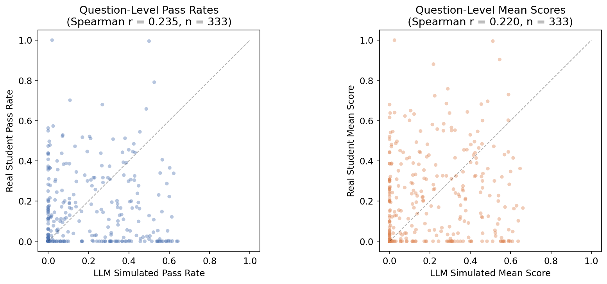
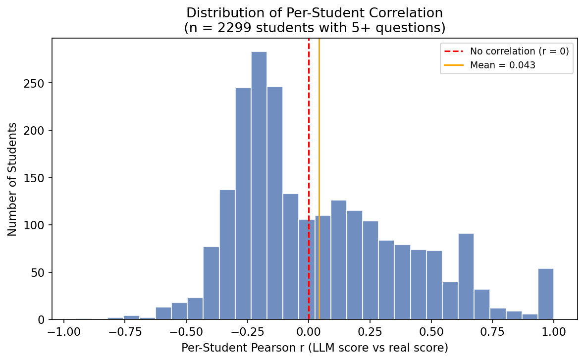
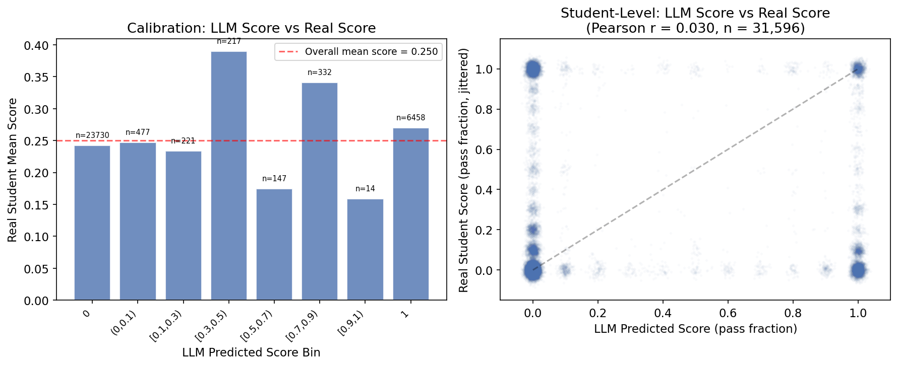
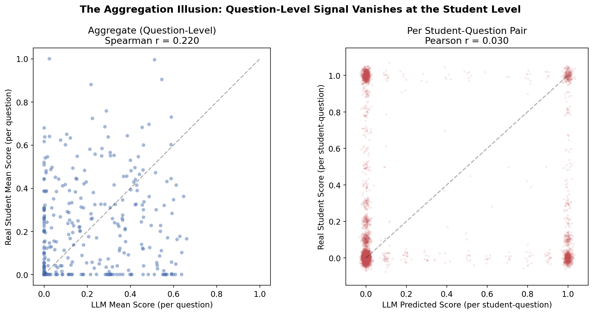

# LLM Simulation Does Not Predict Individual Student Outcomes

## Summary

We evaluated whether LLM-simulated coding submissions can predict real student performance on programming problems. Using 31,596 matched (student, question) pairs across 3,141 students and 316 questions, we find that while aggregate question-level scores show a weak correlation (Spearman r = 0.22), the simulation provides **zero predictive signal at the individual student level** (Pearson r = 0.030, where 0 is no correlation).

The LLM's predicted score for a given student on a given question is statistically independent of the student's actual score.

---

## Data

The simulation pipeline (v4) prompts an LLM with a student profile and 10 few-shot examples of the student's prior work, then asks it to solve a programming problem 50 times. Each attempt produces a binary pass string (e.g., `"0110100000"`) indicating which unit tests passed. We use the fraction of tests passed on the first submission as the predicted score (`y_pred`).

Real student data comes from the same course. We compare against the fraction of tests passed on the real student's first submission (`y_true`). Both scores are continuous values in [0, 1].

| | |
|---|---|
| Matched (student, question) pairs | 31,596 |
| Unique students | 3,141 |
| Unique questions | 316 |
| Overall real mean score | 0.250 |
| Both sides filtered to | Submit only, first attempt |

---

## Prediction Method

For each (student, question) pair, the prediction pipeline works as follows:

1. **Prompt construction**: The LLM receives the student's profile (demographics, course history) along with 10 few-shot examples of the student's prior code submissions on other problems.
2. **Code generation**: The LLM is asked to write a solution to the programming problem as if it were that student. It does this 50 times (50 attempts), alternating between "Precheck" and "Submit" response types to mimic real student behavior on the platform.
3. **Scoring**: Each attempt is run against the problem's unit tests, producing a binary pass string (e.g., `"0110100000"` means 3 out of 10 tests passed).
4. **Prediction extraction**: We take the **first Submit attempt** and compute the fraction of tests passed. This fraction is the predicted score (`y_pred`).

The ground truth (`y_true`) is computed the same way — the fraction of test cases passed on the real student's first submission. Both sides are filtered to Submit responses only to ensure a like-for-like comparison.

There is no training step — the LLM is not fine-tuned or calibrated on any student outcome data. The prediction is purely zero-shot: the LLM's test-pass fraction on its first attempt *is* the prediction.

---

## Aggregate-Level: Weak but Real Correlation

When we average across all submissions, the LLM's aggregate scores are close to real student scores:

| Metric | LLM Simulated | Real Students |
|---|---|---|
| Mean score (fraction of tests passed) | 0.124 | 0.149 |
| Full-pass rate (all tests passed) | 10.3% | 9.1% |

At the question level, there is a weak positive correlation (Spearman r = 0.22) between how well the LLM does on a question and how well real students do. The LLM has a slight ability to rank questions by difficulty: questions it struggles with tend to be questions students also struggle with.

---

## Student-Level: Indistinguishable from Random

The aggregate correlation vanishes entirely when we evaluate at the level that matters: can the LLM predict a *specific student's* score on a *specific question*?

| Metric | Value | Random baseline |
|---|---|---|
| Pearson r | 0.030 | 0.000 |
| Spearman rho | 0.047 | 0.000 |
| Per-student mean Pearson r | 0.043 | 0.000 |
| Per-student median Pearson r | -0.060 | 0.000 |
| Students with r > 0 | 45.6% | 50% expected |

The overall Pearson r of 0.030 is near zero — the LLM score explains less than 0.1% of the variance in real student scores. The median per-student correlation is actually *negative* (-0.060), meaning for the typical student, the LLM's predictions are slightly inversely related to their actual performance.

---

## Calibration: LLM Confidence Is Meaningless

A well-calibrated predictor should show higher real scores when it predicts higher scores. The LLM shows no such pattern:

| LLM Predicted Score | Real Student Mean Score | n |
|---|---|---|
| 0 (complete fail) | 0.243 | 23,730 |
| (0, 0.1) | 0.247 | 477 |
| [0.1, 0.3) | 0.234 | 221 |
| [0.3, 0.5) | 0.390 | 217 |
| [0.5, 0.7) | 0.174 | 147 |
| [0.7, 0.9) | 0.341 | 332 |
| [0.9, 1) | 0.158 | 14 |
| 1 (complete pass) | 0.270 | 6,458 |

When the LLM scores 0 (fails every test case), real students average 0.243. When the LLM scores 1 (passes every test case), real students average 0.270. The difference is negligible. The LLM's confidence carries no information about the student's actual score.

The non-monotonic pattern (0.174 at [0.5, 0.7), then 0.341 at [0.7, 0.9)) further confirms there is no systematic relationship.

---

## The Aggregation Illusion

The contrast between aggregate and student-level results is stark:

On the left, question-level averages show a visible (if noisy) positive trend (Spearman r = 0.22). On the right, individual student-question pairs show no relationship (Pearson r = 0.03). The aggregate correlation exists because some questions are universally easy (both the LLM and most students pass) and some are universally hard (both struggle). But this tells us nothing about which *students* will score higher or lower — the LLM solves problems based on its own coding ability, not the student's.

---

## Conclusion

The LLM simulation data is statistically independent of real student scores at the per-(student, question) level:

- **Pearson r = 0.030**: the LLM score explains < 0.1% of the variance in real student scores
- **Median per-student r = -0.060**: for the typical student, predictions are slightly *anti-correlated*
- **Kendall tau = 0.004**: the LLM cannot rank students within a question
- **Calibration is flat**: a predicted score of 0 and 1 yield nearly the same real student mean score (~0.25)
- **No identifiable subgroup** of students or questions shows meaningfully better prediction

The weak aggregate correlation (Spearman r = 0.22 at the question level) reflects shared question difficulty, not student-level signal. The simulation captures something about which problems are hard in general, but nothing about which students will succeed or fail on any given problem.
